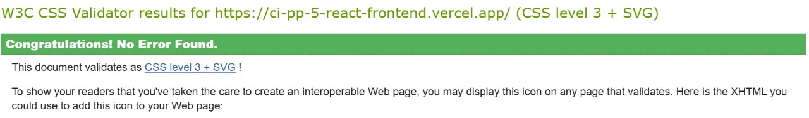

# Introduction
Powerhouse is a cutting-edge B2C eCommerce platform dedicated to gym enthusiasts, athletes, and anyone passionate about fitness. Specializing in high-quality gymwear and top-tier fitness equipment, Powerhouse offers a seamless online shopping experience tailored to individuals who demand both performance and style. From breathable, functional activewear to heavy-duty home gym gear, every product is curated to support serious training and everyday workouts. With user-friendly navigation and fast delivery, Powerhouse is the go-to online destination for fitness lovers looking to gear up and level up—all in one powerful platform.

This website has been created as a learning exercise for the [Code Institute](https://codeinstitute.net/) fifth portfolio project.

Access the live app [here](https://ci-pp-5-react-frontend.vercel.app/)

### Project Goals

- To create a visually appealing website
- To create a website that is easy to navigate
- To create a website that is responsive across all devices
- To create an interactive website
- To create a website that is fun and easy to use

# User Stories

### User Goals

- As a user, I want to view the site on any device to shop.
- As a user, I want to create an account to save my details for future purchases.
- As a user, I want to log in and out of my account to manage my profile securely.
- As a user, I want to find products easily so I can easily locate what I want.
- As a user, I want to view product details to decide whether I want to buy it.
- As a user, I want to add products to my shopping cart to prepare for buying.
- As a user, I want to be able to edit the quantity of products in my shopping cart to get the exact amount I need.
- As a user, I want to delete products from my shopping cart if I change my mind.
- As a user, I want to view my shopping cart to see the total cost of my items.
- As a user, I want to check out securely to purchase my items safely.
- As a user, I want to view my orders to track past purchases.
- As a user, I want to filter products by category to find them easily.
- As a user, I want to be able to view and update my profile.

## Agile development

Link to my [GitHub Agile Project](https://github.com/users/raed-nimer/projects/4)

I felt more confident implementing the Agile methodology since I had experience with it from the last project. I decided to use Kanban and the MOSCOW prioritization method for this project.

Epics and User stories helped me organize the project better. And it can be even more efficient when used within a team. I will continue using this methodology for my future projects, considering it very helpful. I will also start exploring Jira, which is also considered a good agile and project management tool.

I created four columns: Backlog, In Progress, In review, and Done. I also created 9 labels:

For MoSCoW prioritization: Must-have, Should-have, Could-have, Won't-have
5 helper labels: bug, Epic, documentation, enhancement, User-story

## Tools and technologies used

### Languages and Frameworks

### React Packages

### Other tools and programs

# Features

### Home page

- The home page is the first page that appears when a user visits the website.

- The page features a hero section with a promotional heading, a short tagline, and a clear call-to-action button ("Shop Now").

- The page contains a "Latest Products" section with product listings including images, prices, and action buttons (View Details, Add to Cart).

- The footer includes branding and copyright.

# Testing

## Code Validation

### HTML Validation

- All pages were checked and passed through the official [W3C](https://validator.w3.org/nu/) validator.
- Validation was done on the live app deployed on Vercel.

| Page                 | Validation image                                                                |
| -------------------- | ------------------------------------------------------------------------------- |
| Home page            |                  |
| About page           |                |
| Cart page            |                  |
| Checkout page        |          |
| Contact page         |            |
| Login page           |                    |
| Register page        |              |
| Profile page         |                |
| Product Details page |        |
| Products page        |        |
| My Orders page       |       |

### CSS Validation

- No errors were found when passing it through the official [jigsaw](https://jigsaw.w3.org/css-validator/) validator.

