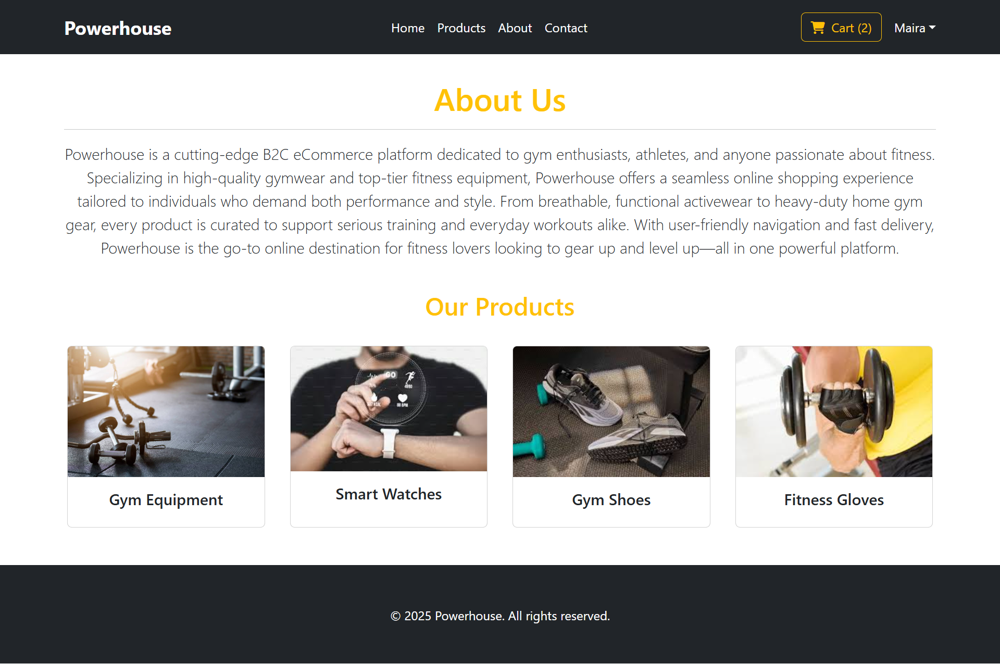
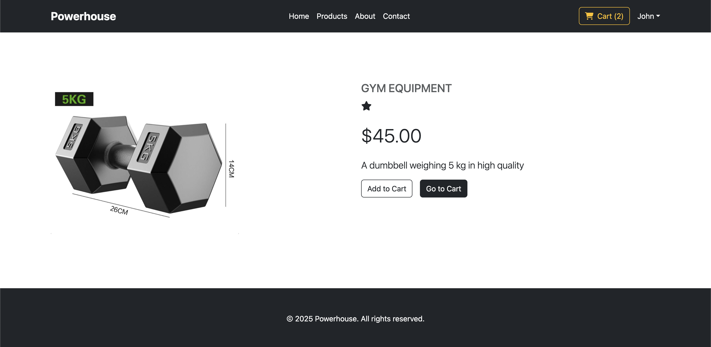

# Introduction
Powerhouse is a cutting-edge B2C eCommerce platform dedicated to gym enthusiasts, athletes, and anyone passionate about fitness. Specializing in high-quality gymwear and top-tier fitness equipment, Powerhouse offers a seamless online shopping experience tailored to individuals who demand both performance and style. From breathable, functional activewear to heavy-duty home gym gear, every product is curated to support serious training and everyday workouts. With user-friendly navigation and fast delivery, Powerhouse is the go-to online destination for fitness lovers looking to gear up and level up—all in one powerful platform.

This website has been created as a learning exercise for the [Code Institute](https://codeinstitute.net/) fifth portfolio project.

Access the live app [here](https://ci-pp-5-react-frontend.vercel.app/)

### Project Goals

- To create a visually appealing website
- To create a website that is easy to navigate
- To create a website that is responsive across all devices
- To create an interactive website
- To create a website that is fun and easy to use

# User Stories

### User Goals

- As a user, I want to view the site on any device to shop.
- As a user, I want to create an account to save my details for future purchases.
- As a user, I want to log in and out of my account to manage my profile securely.
- As a user, I want to find products easily so I can easily locate what I want.
- As a user, I want to view product details to decide whether I want to buy it.
- As a user, I want to add products to my shopping cart to prepare for buying.
- As a user, I want to be able to edit the quantity of products in my shopping cart to get the exact amount I need.
- As a user, I want to delete products from my shopping cart if I change my mind.
- As a user, I want to view my shopping cart to see the total cost of my items.
- As a user, I want to check out securely to purchase my items safely.
- As a user, I want to view my orders to track past purchases.
- As a user, I want to filter products by category to find them easily.
- As a user, I want to be able to view and update my profile.

## Agile development

Link to my [GitHub Agile Project](https://github.com/users/raed-nimer/projects/4)

I felt more confident implementing the Agile methodology since I had experience with it from the last project. I decided to use Kanban and the MOSCOW prioritization method for this project.

Epics and User stories helped me organize the project better. And it can be even more efficient when used within a team. I will continue using this methodology for my future projects, considering it very helpful. I will also start exploring Jira, which is also considered a good agile and project management tool.

I created four columns: Backlog, In Progress, In review, and Done. I also created 9 labels:

For MoSCoW prioritization: Must-have, Should-have, Could-have, Won't-have
5 helper labels: bug, Epic, documentation, enhancement, User-story

## Tools and technologies used

### Languages and Frameworks

### React Packages

### Other tools and programs

# Features

# Features

### Home page

- The Home page is the first page that appears when a user visits the website.

- The page features a hero section with a promotional heading, a short tagline, and a clear call-to-action button ("Shop Now").

- The page contains a "Latest Products" section with product listings including images, prices, and action buttons (View Details, Add to Cart).

- The footer includes branding and copyright.

### About page

- The About page provides a clear and concise overview of the brand's mission and values.

- It introduces Powerhouse as a modern B2C eCommerce platform for gym enthusiasts and fitness lovers.

- A featured "Our Products" section showcases key product categories with images, helping users understand the offerings at a glance.

### Contact page

- The contact page can be used to contact the Powerhouse team for inquiries, support, or feedback.

- The contact page consists of four inputs to fill out: Name, Email, Subject, and Description.

- If a user has any questions or concerns, they can go to the contact page, fill in their name, the email they wish to be contacted at, the subject of the matter, and then describe the matter in more detail in the description section for the support team.

### Products page

- The Products page showcases the products available on Powerhouse, including gym equipment, wearables, and fitness machines.

- Users can easily filter products by categories such as Men’s Gym Wear, Gym Shoes, Gym Equipment, Fitness Gloves etc.

- Each product card includes product image, product name, short description, price, and two action buttons (View Details, Add to Cart)

### Product Details page

- The Product Details page is used to view detailed information about a specific product.

- It displays an image of the product, the product category, the product name, price, a short description, and interactive buttons for purchasing.

- Users can choose to "Add to Cart" or directly "Go to Cart" from this page. It also includes a “You may also like” section to recommend similar items to users.

### Cart page

- The Cart page is used to review selected products, update quantities, and proceed to checkout.

- It displays an itemized list showing the product image, name, quantity adjustment controls (plus/minus), and price per unit multiplied by quantity.

- On the right side, the Order Summary includes the total number of products, shipping cost, and the overall total. A clear call-to-action button allows users to continue to the checkout process.

### Checkout page

- The Checkout page is used to finalize the purchase by providing billing details and selecting a payment method.

- It includes a Billing Address form with fields for First Name, Last Name, Email, Address, Country, State, and Zip code.

- The page offers a Payment Method section with a selectable option (e.g., Cash on Delivery).

- On the right, there is an Order Summary showing the number of products, shipping cost, and total amount.

- A “Place Order” button allows users to complete the transaction.

### My Orders page

- The My Orders page displays all previous orders placed by the user in an organized layout.

- Each order shows the order ID, order date and time, and a list of purchased items with their images, names, quantities, and prices at the time of purchase.

### Profile page

- The profile page allows you to update your personal information, including your name, last name and email.

- It provides a simple interface for managing your account details, ensuring your profile stays up-to-date.

### Register page

- The register page is where a first-time user can create their account.

- It has a form with the first name, last name, email, and password.

### Login page

- The login page is where a registered user can log in to their account.

- It has a form with the email address and password fields.

# Testing

## Code Validation

### HTML Validation

- All pages were checked and passed through the official [W3C](https://validator.w3.org/nu/) validator.
- Validation was done on the live app deployed on Vercel.

| Page                 | Validation image                                                                |
| -------------------- | ------------------------------------------------------------------------------- |
| Home page            |                  |
| About page           |                |
| Cart page            |                  |
| Checkout page        |          |
| Contact page         |            |
| Login page           |                    |
| Register page        |              |
| Profile page         |                |
| Product Details page |        |
| Products page        |        |
| My Orders page       |       |

### CSS Validation

- No errors were found when passing it through the official [jigsaw](https://jigsaw.w3.org/css-validator/) validator.

## Manual Testing
### Devices and browsers used for testing

### User Stories Testing

| Expectation                                                                               | Solution                                                                                                                               | Image                                                                                                                                                       |
| ----------------------------------------------------------------------------------------- | -------------------------------------------------------------------------------------------------------------------------------------- | ----------------------------------------------------------------------------------------------------------------------------------------------------------- |
| As a user, I want to be able to easily navigate the web App.                              | The navigation bar is added to the top of the page.                                                                                    |                                                                              |
| As a user, I want to be able to easily see the cart items.                                | All pages have a cart button in the navigation bar.                                                                                    |                                                                                   |
| As a user, I want to be able to register an account.                                      | Register button is in the navbar, and available on all pages.                                                                          |                                                                            |
| As a user, I want to be able to easily log in and log out of my account.                  | Login and Logout buttons are in the navbar and available on all pages. Logout button is included inside a dropdown.                    |   |
| As an authenticated user, I want to be able to see my orders.                             | The My Orders button is available inside the dropdown of navbar.                                                                       |                                                                         |
| As an authenticated user, I want to be able to go to checkout page to complete the order. | The Go to Checkout button is available in cart page.                                                                                   |                                                               |
| As a user, I want to be able to easily contact Powerhouse team.                           | The Contact button is available on the navbar on all pages.                                                                            |                                                                             |
| As a user, I want to be able to view and edit my profile.                                 | The current user profile button is available under the dropdown by the username. User can view and edit profile from the profile page. |                                                                             |

